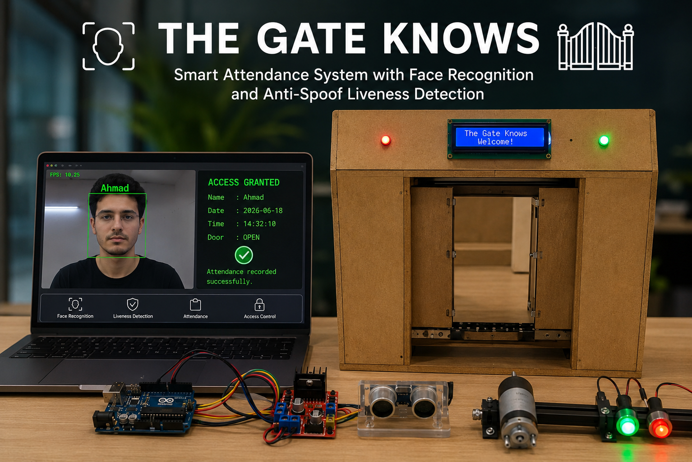
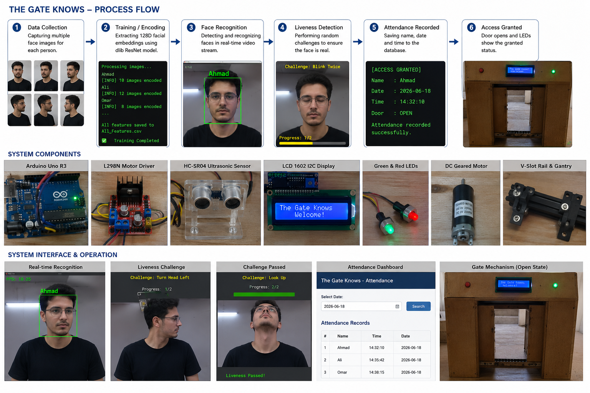

# The Gate Knows


## Smart access System with Face Recognition and Anti-Spoof Liveness Detection

The Gate Knows is an AI-powered smart access control system that combines real-time face recognition, anti-spoof liveness verification, attendance management, and automated gate control.

The project was developed as a graduation project at the Faculty of Artificial Intelligence, Kafrelsheikh University.

The system eliminates traditional attendance methods such as paper sheets, ID cards, and manual registration by replacing them with automated biometric verification and intelligent access control.

---

## Project Overview

The system operates through three major modules:

1. Training Module
2. Face Recognition & Liveness Detection Module
3. Attendance Dashboard

A user first registers by providing multiple facial images. The system extracts facial embeddings using dlib's ResNet model and stores them for future recognition.

During operation, a webcam captures live video streams, detects faces, verifies identities, performs randomized liveness checks, records attendance, and grants access only to authenticated users.

---

## Key Features

### Face Recognition

* Real-time face detection using dlib HOG detector
* 68 facial landmark extraction
* 128-dimensional facial embeddings
* Euclidean distance matching
* Recognition threshold = 0.4

### Anti-Spoof Liveness Detection

Randomized challenge-response system including:

* Blink once
* Blink twice
* Turn head left
* Turn head right
* Look up
* Look down
* Nod movement

Two random challenges are generated for every session to prevent:

* Printed photo attacks
* Screen replay attacks
* Pre-recorded video attacks

### Attendance Management

* Automatic attendance recording
* SQLite database storage
* Duplicate attendance prevention
* Daily attendance tracking

### Administrative Dashboard

* Flask web application
* Attendance search by date
* Attendance visualization
* Real-time database access

### Smart Gate Integration

* Hardware-controlled automated gate
* Arduino-based control system
* Motorized door opening mechanism
* Ultrasonic safety detection
* LCD status display
* LED indicators

---

## System Architecture

```text
                    +------------------+
                    | Training Module  |
                    | Face Encoding    |
                    +---------+--------+
                              |
                              v
                     All_Features.csv
                              |
                              v
+-------------+     +---------+---------+     +-------------+
| USB Camera  | --> | Recognition Core | --> | Attendance  |
| Live Stream |     | + Liveness Check |     | Database    |
+-------------+     +---------+---------+     +-------------+
                              |
                              v
                     Access Decision
                              |
                              v
                     Smart Gate System


```

---


---

## Technologies Used

### Artificial Intelligence

* dlib
* OpenCV
* NumPy
* SciPy
* Pandas

### Backend

* Python
* Flask
* SQLite

### Hardware

* Arduino Uno R3
* Raspberry Pi 4
* ESP32-CAM
* L298N Motor Driver
* HC-SR04 Ultrasonic Sensor
* LCD 1602 Display
* DC Geared Motor
* USB HD Camera

---

## Face Recognition Pipeline

### Training Phase

1. Read face images from dataset
2. Detect face using HOG detector
3. Extract 68 facial landmarks
4. Generate 128D embedding using dlib ResNet
5. Average embeddings per person
6. Save features to All_Features.csv

### Recognition Phase

1. Capture webcam frame
2. Detect face
3. Extract landmarks
4. Generate embedding
5. Compare against stored embeddings
6. Verify identity
7. Launch liveness challenge

### Attendance Phase

1. Confirm liveness
2. Record attendance
3. Store in SQLite database
4. Open gate

---

## Database Schema

```sql
CREATE TABLE attendance (
    name TEXT,
    time TEXT,
    date DATE,
    UNIQUE(name, date)
);
```

This constraint prevents duplicate attendance records on the same day.

---

## Installation

### Clone Repository

```bash
git clone https://github.com/YOUR_USERNAME/The-Gate-Knows.git
cd The-Gate-Knows
```

### Install Dependencies

```bash
pip install -r requirements.txt
```

### Required Models

Download and place the following files inside the `models/` directory:

* shape_predictor_68_face_landmarks.dat
* dlib_face_recognition_resnet_model_v1.dat

Official Source:

http://dlib.net/

---

## Quick Start

### Step 1 – Prepare Dataset

Create a folder for each person:

```text
dataset/
│
├── Person1/
├── Person2/
├── Person3/
```

Each folder should contain 5–10 clear face images.

---

### Step 2 – Generate Facial Features

Run:

```bash
Training.ipynb
```

This generates:

```text
All_Features.csv
```

---

### Step 3 – Start Recognition System

Run:

```bash
Camera.ipynb
```

or

```bash
Camera_antiSpoofing.ipynb
```

---

### Step 4 – Launch Dashboard

Run:

```bash
App.ipynb
```

Then open:

```text
http://127.0.0.1:5000
```

---

## Security Features

### Protection Against

✅ Photo Spoofing

✅ Screen Replay Attacks

✅ Video Replay Attacks

✅ Duplicate Attendance Fraud

### Current Limitation

❌ High-quality 3D mask attacks

Future versions may include:

* IR Cameras
* Depth Sensors
* Deep Learning Anti-Spoof Models

---

## Hardware Evolution

### Phase 1

Laptop + Arduino

### Phase 2

ESP32-CAM + Wireless Streaming

### Phase 3

Standalone Raspberry Pi Deployment

---

## Future Improvements

* Cloud-based attendance synchronization
* Mobile application
* Face mask recognition
* Multi-camera support
* Deep learning anti-spoof models
* Role-based administration system
* REST API integration

---

## Team

Airontic Team

Faculty of Artificial Intelligence

Kafrelsheikh University

2026

---

## License

This project is developed for educational and research purposes.
